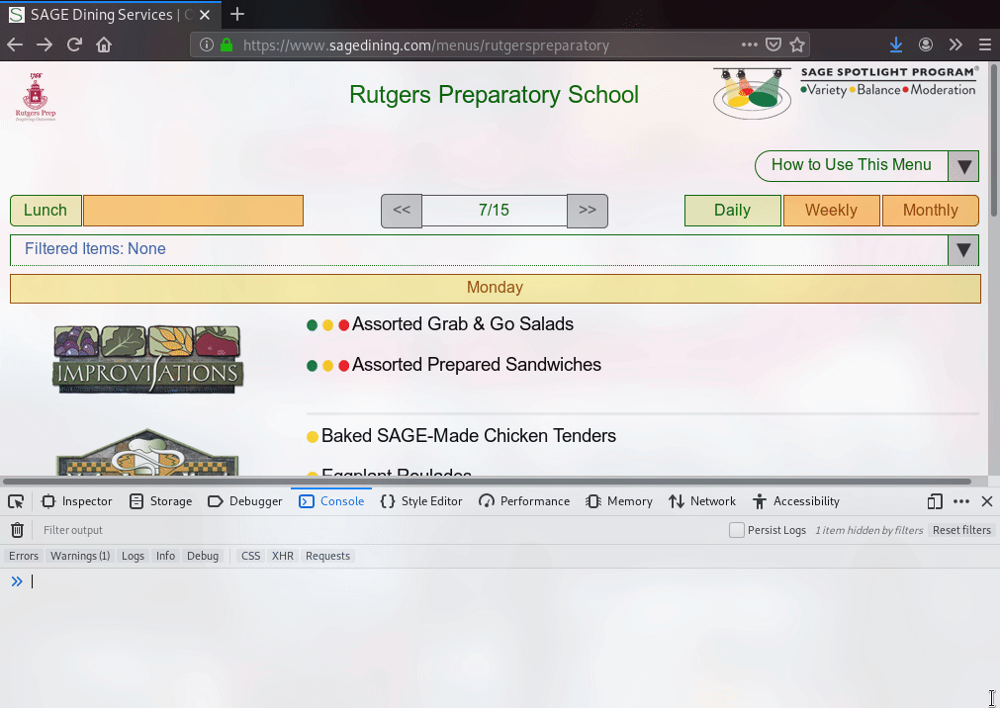

# Sage Dining Python Library

Python library for interacting with Sage Dining menus and their internal API.

Designed with Python 3.7 in mind.

## Usage

To use this library you first need to connect to Sage Dining.
This library handles that when creating a `Sage` object, given that you know the id of the menu.


How to obtain the menu ID

After creating a `Sage` object, you must call `update()` on it to retrieve data from the server.
After calling it, the data is cached so excess calls aren't made.

```python
from sagedining.core import Sage

sage_object = Sage("S0182") # replaced with your ID
sage_object.update() # must be called
```

To obtain a list of items served at various selected stations on a given day, just use `get_categories_date`.
Note that all of the dates used in this library use `datetime`.

```python
from sagedining.core import Meal, MenuCategory
from datetime import datetime

menu_categories = sage_object.get_categories_date(datetime.datetime.today(), Meal.LUNCH, [
    MenuCategory.MAIN_INGREDIENT,
    MenuCategory.IMPROVISATIONS
])
```

This returns an array for every category passed in containing `SageMenuItems`, which map to the menu items being served.

```python
for category in menu_categories:
    for menu_item in category:
        print(f"Name: {str(menu_item)}")
        print(f"Healthiness Rating: {str(menu_item.health_rating)}")
```
